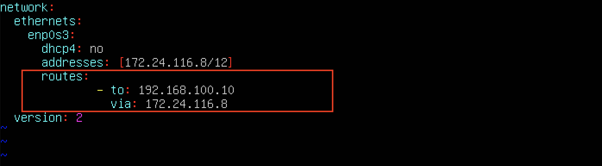
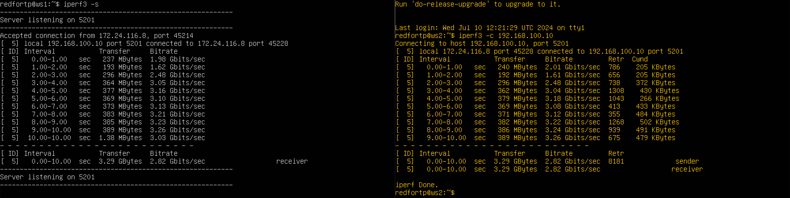
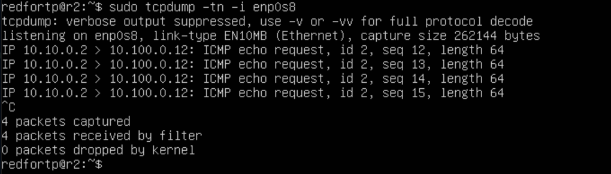
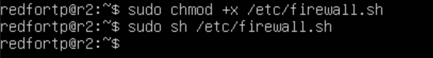

## Part 1. Инструмент ipcalc

1) установили ipcalc командой 

```
sudo apt install ipcalc
```
#### 1.1. Сети и маски

* ##### 1) Скриншот с выводом команды `ipcalc -b 192.167.38.54/13`


```
ipcalc -b
```

##### Определили адрес сети хоста - 192.160.0.0

2) 255.255.255.0 = /24 или 11111111.11111111.11111111.00000000,<br> /15 = 255.254.0.0 или 11111111.11111110.00000000.00000000, <br> 11111111.11111111.11111111.11110000 = 255.255.255.240 или /28

3) Минимальный и максимальный хост в сети 12.167.38.4 при масках: /8 : min = 12.0.0.1, max = 12.255.255.254; <br> 11111111.11111111.00000000.00000000 : min = 12.167.0.1, max = 12.167.255.254; <br> 255.255.254.0 : min = 12.167.38.1, max = 12.167.39.254; <br>/4 : min = 0.0.0.1, max = 15.255.255.254;

#### 1.2. localhost 

#### Диапазон IP-адресов, которые предназначены для создания локальных сетей: 127.0.0.1 - 127.255.255.255 <br> 
---
#### 194.34.23.100 - нельзя использовать как localhost,
---
#### 127.0.0.2 - можно,
---
#### 127.1.0.1 - можно,
---
#### 128.0.0.1 - нельзя. <br><br>

### 1.3. Диапазоны и сегменты сетей

#### 10.0.0.0 — 10.255.255.255 (10.0.0.0/8),
#### 172.16.0.0 — 172.31.255.255 (172.16.0.0/12),
#### 192.168.0.0 — 192.168.255.255 (192.168.0.0/16).
#### 127.0.0.0 — 127.255.255.255 (Reserved for loopback interfaces (not used for communication between network nodes), so called localhost).
### Перечисленные выше сети являются `private` и получается что
---
#### 10.0.0.45 - private,
---
#### 134.43.0.2 - public,
---
#### 192.168.4.2 - private,
---
#### 172.20.250.4 - private,
---
#### 172.0.2.1 - public,
---
#### 192.172.0.1 - public,
---
#### 172.68.0.2 - public,
---
#### 172.16.255.255 - private,
---
#### 10.10.10.10 - private,
---
#### 192.169.168.1 - public. <br><br>

### Какие из перечисленных IP адресов шлюза возможны у сети 10.10.0.0/18:
----
#### 10.0.0.1 - может быть шлюзом
----
#### 10.10.0.2 - может
----
#### 10.10.10.10 - может
----
#### 10.10.100.1 - не может
----
#### 10.10.1.255 - может
----
<br><br>

## Part 2. Статическая маршрутизация между двумя машинами

#### Посмотрим существующие сетевые интерфейсы c помощью команды 

```
ip a
```
#### Скриншот с выводом команды `ip a` на двух машинах 


### 2.1. Добавление статического маршрута вручную


Используем следующую команду для открытия файла и установки в нём статического адреса.

```
sudo nano /etc/netplan/00-installer-config.yaml
```

*etc/netplan/00-installer-config.yaml* - файл который нужно отредактировать на каждой машине. Этот файл отвечает за настройку интерфейсов сети. <br>
Изначально файл выглядит так:

 


Добавление статического маршрута вручную <br>


<br>

Выполним команду netplan apply для перезапуска сервиса сети <br>
И проверяем адреса машин


С помощью следующей команды перепроверяем настройки

```
ip a
```


пробрасывания портов и пинг <br>


### 2.1. Добавление статического маршрута вручную

2.1.1 Добавим статический маршрут от одной машины до другой и обратно

```
sudo ip route add 172.24.116.8 dev enp0s3
```


проверка добавления с помощью *netstat -nr*
<br> 


<br> 
так же для другой машины: 


проверка добавления с помощью *netstat -nr*
<br> 


#### Пропингуем соединение между машинами с помощью следующей команды

```
ping -c 5 <IP-address>
```

*ping -c 5 172.24.116.8*


*ping -c 5 192.168.100.10*


### 2.2. Добавление статического маршрута с сохранением

Перезапустим машины, данные не сохранились

```
reboot
```


<br>


#### Добавляем статический маршрут от одной машины до другой, редактируя файл *etc/netplan/00-installer-config.yaml*.
<br>
указывваем туннели:


<br>



#### Применяем новые настройки с помощью команды

```
sudo netplan apply
```

Пропингуем соединение между машинами

```
ping -c 5 <IP-address>
```


Делаем 

```
reboot
```

И пингуем заново, проверяем


## Part 3. Утилита iperf3

### 3.1. Скорость соединения
* #### 8Mbps = 1 MB/s
* #### 100 MB/s = 800000 Kbps
* #### 1Gbps = 1000 Mbps

### Изменения настроек VirtualBox для того чтобы у ws1 и ws2 появился доступ к внешней сети, чтобы установить iperf3

- Изначально VirtualBox был настроен так, что на виртуальных машинах в Настроить - Сеть - Адптер_1 - Тип подключения выставлена опция Внутренняя сеть, а другие Адаптеры отключены. Однако такая настройка не позволяет выходить в интернет, соответственно скачивать обновления и устанавливать различные програмные продукты. Чтобы это исправить:
1. Отключаем ws1 и ws2.
2. Заходим в настройки каждой: ws Сети - Адаптер_1 и устанавливаем Тип подключения: NAT.
3. Переходим тут же в Адаптер_2, устанавливаем галочку Включить сетевой адаптер. После включения адаптера устанавливаем Тип подключения: Внутренняя сеть.
4. После настройки машин ws1 и ws2, запускаем их.
5. Далее надо настроить ws2 и ws1. Для этого отредактировать файл /etc/netplan/00-installer-config.yaml.

```
sudo vim /etc/netplan/00-installer-config.yaml

```


- Принимаем изменеия настроек сети и проверяем настройки интерфейсов

```
sudo netplan apply

ip a
```


- После перезагрузки виртуальных машин можно убедиться что всё правильно настроено


- Теперь можно устанавливать необходимые програмные пакеты.
- Установка утилиты iperf3 осуществляется с помощью команды

```
sudo apt install iperf3
```

`iperf3` — утилита имеет как серверную часть так и клиентскую, надо рассматривать обе отдельно. Чтобы протестировать пропускную способность сети, нужно сначала подключиться к удаленной машине, которая будет использоваться в качестве сервера. Для запуска сервера (по умолчанию он будет прослушивать порт 5201) используется синтаксис:

```
iperf3 -s 
```


Затем на локальном компьютере, который рассматривается как клиент, нужно запустить iperf3 в клиентском режиме, используя флаг -c, и указать хост, на котором работает сервер (используя либо его IP-адрес, либо домен, либо имя хоста).

- Запускаем на ws2 утилиту в режиме клиент с флагом -c и указываем IP-адрес ws1.

```
iperf3 -c 192.168.100.10
```



## Part 4. Сетевой экран

`4.1. Утилита iptables`

* #### Установка iptables 
```
sudo apt install iptables
```
#### На ws1 и ws2 создали файл `/etc/firewall.sh` в котором прописали следующие команды:
<br>
на ws1:


на ws2:


- Запустили этот файл на обеих машинах командами 
```
sudo chmod +x /etc/firewall.sh
 и
sudo bash /etc/firewall.sh
```


пропинговали соединения между машинами


#### Разница между стратегиями, применёнными в первом и втором файлах, заключается в следующем: в утилите iptables правила выполняются сверху вниз. На первой машине первым указано запрещающее правило на выход, поэтому она не сможет пропинговать другую машину. У второй машины, наоброт - первым указано разрешающее правило, значит она сможет пропинговать другую машину.

`4.2. Утилита nmap`

Установим утилиту nmap с помощью следующей команды

```
sudo apt install nmap
```
- поиск машины, которая не пингуется:


Запускаем утилиту nmap командой
 
```
sudo nmap ip-addres
```


## Part 5. Статическая маршрутизация сети

### 5.1. Настройка адресов машин

#### Настройка конфигурации машин в etc/netplan/00-installer-config.yaml согласно сети на рисунке.


  проверяем, что адрес машины задан верно:

 ```
 ip -4 a
 ```

 

 пропингуем ws22 с ws21 и r1 с ws11:

  

### 5.2. Включение переадресации IP-адресов

Для включения переадресации IP, выполняем команду на роутерах

```
sudo sysctl -w net.ipv4.ip_forward=1
```


Однако при таком подходе переадресация не будет работать после перезагрузки системы.
<br>
Откроем файл ***/etc/sysctl.conf***

Раскомментируем строку net.ipv4.ip_forward = 1 и сохраним изменения. Теперь IP-переадресация включена на постоянной основе.


- Затем применить изменения командой: 

```
sysctl -p
```


- Проверим командой `sysctl net.ipv4.ip_forward`

### 5.3. Установка маршрута по-умолчанию

Настраиваем маршрут по-умолчанию (шлюз) для рабочих станций. Для этого добавляем gateway4: ip роутера в файле конфигураций ***etc/netplan/00-installer-config.yaml***


Добавился маршрут в таблицу маршрутизации:

 ```
 ip r
 ```

 

 Пропингуем с ws11 роутер r2, пинг не пройдёт, т.к. роутер "не знает" куда вернуть ответ, при этом передача пакетов с машины осуществляется.

Необходимо скачать tcpdump:

```
sudo apt install tcpdump
```
на r2;


Чтобы посмотреть какие девайсы можно прослушать

```
tcpdump -D
```


Запускаем на r2 утилиту tcpdump, она позволяет прослушать порты и вывести на экран информацию с каких IP адресов приходят пакеты. В данном случае слушаем интерфейс enp0s8

```
tcpdump -tn -i enp0s8
```


Сначала на экране r2 будет пусто, идёт ожидание входящих пакетов

Запускаем ping на ws11

```
ping -c 5 10.100.0.12
```
  


На экране должно r2 должно появиться:



- Пинг доходит

### 5.4. Добавление статических маршрутов

Добавили роутеры  r1 и r2 статические маршруты в файле конфигураций


- таблицы с маршрутами на обоих роутерах:

```
ip r
```


Запустить команды на ws11

```
ip r list 10.10.0.0/18

ip r list 0.0.0.0/0
```


 - Для адреса 10.10.0.0/18 был выбран маршрут, отличный от 0.0.0.0/0 (он попадает под маршрут по-умолчанию), т.к. машина ws11 соединена с сетью 10.10.0.0/18 по своему IP-адресу 10.10.0.2, для других адресов используется маршрут по умолчанию, который указан в файле 10.10.0.1.

### 5.5. Построение списка маршрутизаторов

##### Для определения промежуточных маршрутизаторов traceroute отправляет целевому узлу серию ICMP-пакетов (по умолчанию 3 пакета), с каждым шагом увеличивая значение поля TTL («время жизни») на 1.

- Запустим на r1 команду дампа

```
tcpdump -tnv -i enp0s8 
```


- на ws11 скачать traceroute:

```
sudo apt install traceroute
```

- При помощи утилиты traceroute построим список маршрутизаторов на пути от ws11 до ws21.

```
sudo traceroute 10.20.0.10
```


`Каждый пакет проходит на своем пути определенное количество узлов, пока достигнет своей цели. Причем, каждый пакет имеет свое время жизни. Это количество узлов, которые может пройти пакет перед тем, как он будет уничтожен. Этот параметр записывается в заголовке TTL, каждый маршрутизатор, через который будет проходить пакет уменьшает его на единицу. При TTL=0 пакет уничтожается, а отправителю отсылается сообщение Time Exceeded. <br>
Команда traceroute linux использует UDP пакеты. Она отправляет пакет с TTL=1 и смотрит адрес ответившего узла, дальше TTL=2, TTL=3 и так пока не достигнет цели. Каждый раз отправляется по три пакета и для каждого из них измеряется время прохождения. Пакет отправляется на случайный порт, который, скорее всего, не занят. Когда утилита traceroute получает сообщение от целевого узла о том, что порт недоступен трассировка считается завершенной.`


`Процесс повторяется до тех пор, пока пакет не достигнет целевого узла. При получении ответа от этого узла процесс трассировки считается завершённым.`

`На оконечном хосте IP-датаграмма с TTL = 1 не отбрасывается и не вызывает ICMP-сообщения типа срок истёк, а должна быть отдана приложению. Достижение пункта назначения определяется следующим образом: отсылаемые traceroute датаграммы содержат UDP-пакет с заведомо неиспользуемым номером порта на адресуемом хосте. Номер порта будет равен 33434 + (максимальное количество транзитных участков до узла) — 1. В пункте назначения UDP-модуль, получая подобные датаграммы, возвращает ICMP-сообщения об ошибке «порт недоступен». Таким образом, чтобы узнать о завершении работы, программе traceroute достаточно обнаружить, что поступило ICMP-сообщение об ошибке этого типа.`


### 5.6. Использование протокола **ICMP** при маршрутизации

Запустим на r1 перехват сетевого трафика, проходящего через enp0s8 с помощью команды

```
sudo tcpdump -n -i enp0s8 icmp
```


Пропингуем с ws11 несуществующий IP (например, 10.30.0.111) с помощью команды

```
ping -c 1 10.30.0.111
```


## Part 6. Динамическая настройка IP с помощью DHCP

Сначала установил на r2 

```
isc-dhcp-server
```

##### Для r2 настроила в файле */etc/dhcp/dhcpd.conf* конфигурацию службы **DHCP**:

##### 1) указать адрес маршрутизатора по-умолчанию, DNS-сервер и адрес внутренней сети. Пример файла для r2:


##### 2) в файле *resolv.conf* прописать `nameserver 8.8.8.8.


##### Отредактировала файл /etc/default/isc-dhcp-server


##### Перезагрузить службу **DHCP** командой `systemctl restart isc-dhcp-server`.


##### Установила новые настройки у машины ws21, применил их `sudo netplan apply`


##### Машину ws21 и ws22 перезагрузить при помощи `reboot` и через `ip a` показать, что они получили адрес. Также пропинговать ws22 с ws21

```
ip a
```


```
ping -c 5 10.20.0.3
```


 - Укажи MAC адрес у ws11: 

```
etc/netplan/00-installer-config.yaml 
``` 


- в настройках сети так же укажем mac адрес:


- Для r1 настрой в файле /etc/dhcp/dhcpd.conf конфигурацию службы DHCP:
- Укажем адрес маршрутизатора по-умолчанию, DNS-сервер и адрес с жесткой привязкой к MAC-адресу:


- В файле resolv.conf пропишем nameserver 8.8.8.8:


- Перезагрузим службу DHCP командой systemctl restart isc-dhcp-server:


-  Машину ws11 перезагрузим при помощи reboot и через ip a покажем, что она получила адрес: 


- Также пропингуем ws22 с ws11:

```
ping -c 5 10.10.0.2
```


- Запросим с ws21 обновление ip адреса:

```
sudo dhclient -r enp0s8 (-r означает освободить IP-адрес)
sudo dhclient
ip a
```
- ip a до обновления:


- ip a после обновления:


Новая утилита dhclient служит для управления адресом интерфейса по протоколу DHCP. Опция -r освобождает текущий адрес.

В части 6 были использованы следующие опции DHCP протокола:

option routers ip-address [, ip-address...]; - адреса шлюзов для клиентской сети. Маршрутизаторы должны быть перечислены в порядке предпочтительности.
option domain-name-servers ip-address [, ip-address...]; - Список DNS серверов доступных клиенту. Сервера должны быть перечислены в порядке предпочтительности.


- Сохраняем дампы образов виртуальных машин

## Part 7. NAT

Загрузила снепшоты виртуальных машин из конца 5 части, убрала gateway из настроек yaml и установил на ws22 и r1 apache2

```
sudo apt install apache2
```

В файле /etc/apache2/ports.conf на ws22 и r2 меняем строку Listen 80 на Listen 0.0.0.0:80.

```
sudo vim /etc/apache2/ports.conf
```


Запустить веб-сервер Apache командой на ws22 и r1

```
service apache2 start
```
и проверка статуса работы сервера:


### Добавить в фаервол, созданный по аналогии с фаерволом из Части 4, на r2 следующие правила:

1) Удаление правил в таблице filter - iptables -F;

2) Удаление правил в таблице "NAT" - iptables -F -t nat;

3) Отбрасывать все маршрутизируемые пакеты - iptables --policy FORWARD DROP


Запустим файлы на r2

```
sudo chmod +x /etc/firewall.sh

sudo bash /etc/firewall.sh
```

При запуске файла firewall.sh с этими правилами, ws22 не должна "пинговаться" с r1.

Проверяем соединение между r1 и ws22
```
ping -c 5 10.100.0.11
```


Разрешить маршрутизацию всех пакетов протокола ICMP, для этого прописываем правило для протокола icmp и цепочки FORWARD




Теперь при запуске файла firewall.sh с этими правилами, ws22 должна "пинговаться" с r1

Проверяем соединение между r1 и ws22


Добавляем в файл ещё два правила:

 - Включаем SNAT, а именно маскирование всех локальных ip из локальной сети, находящейся за r2 (по обозначениям из Части 5 - сеть 10.20.0.0)

 - Включаем DNAT на 8080 порт машины r2 и добавим к веб-серверу Apache, запущенному на ws22, доступ извне сети

 

 Значения использованных опций:

- t - указывает на используемую таблицу;
- p - указывает протокол, такие как tcp, udp, udplite и другие, поддерживаемые системой, ознакомиться со списком можно в файле /etc/protocols;
- m - подключает указанный модуль;
- s - указывает адрес источника пакета, в качестве значения можно указать как один IP-адрес, так и диапазон;
- i - задает входящий сетевой интерфейс;
- o - указывает исходящий сетевой интерфейс;
- --dport - порт получателя пакета;
- DNAT — подменяет адрес получателя в заголовке IP-пакета, основное применение — предоставление доступа к сервисам снаружи, находящимся внутри сети;
- SNAT — служит для преобразования сетевых адресов, применимо, когда за сервером находятся машины, которым необходимо предоставить доступ в Интернет, при этом от провайдера имеется статический IP-адрес.

#### Проверяем соединение по TCP для SNAT, для этого с ws22 подключаемся к серверу Apache на r1 командой telnet [адрес] [порт]

```
telnet 10.100.0.11 80
```


#### Проверить подмену IP-адреса можно с помощью команды tcpdump - пингуем с машины ws22 роутер r1, в выводе tcpdump будет отображаться с какого адреса идет запрос - IP-адрес r2


#### Проверяем соединение по TCP для DNAT, для этого с r1 подключаемся к серверу Apache на ws22 (обращаться по адресу r2 и порту 8080)

```
telnet 10.100.0.12 8080
```


При этой проверке следует отключить на ws22 автоматическую выдачу ip enp0s3

```
sudo tcpdump -i enp0s8
```


## Part 8. Дополнительно. Знакомство с SSH Tunnels

#### Для проверки, сработало ли подключение в обоих предыдущих пунктах, перейди во второй терминал (например, клавишами Alt + F2) и выполни команду:

```
telnet 127.0.0.1 [локальный порт]
```

Telnet подключается к локальному порту 8080 на ws21, ws11 который был настроен для прослушивания через SSH-туннель.
Любой трафик, поступающий на порт 8080 на ws21, ws11 будет перенаправлен через SSH-туннель к веб-серверу на ws22, который работает на порту 80.
Telnet в данном случае отправляет простую команду на localhost:8080, чтобы убедиться, что туннель работает корректно и что данные передаются на веб-сервер.


#### Запусти на r2 фаервол с правилами из Части 7.


#### Запусти веб-сервер Apache на ws22 только на localhost (то есть в файле /etc/apache2/ports.conf измени строку Listen 80 на Listen localhost:80).


#### Воспользуйся Local TCP forwarding с ws21 до ws22, чтобы получить доступ к веб-серверу на ws22 с ws21.

- Переадресация локального порта позволяет перенаправить порт на локальном компьютере (клиент ssh) на порт на удаленном компьютере (сервер ssh), который затем перенаправляется на порт на компьютере назначения. В этом типе переадресации клиент SSH прослушивает заданный порт и туннелирует любое подключение к этому порту к указанному порту на удаленном сервере SSH, который затем подключается к порту на целевом компьютере. Конечным компьютером может быть удаленный SSH-сервер или любой другой компьютер.

- Пробрасывать порт от сервера будем по следующему алгоритму:

- На машине ws22: создадим соединение с машины ws22, на которой установлен сервер ssh, с машиной ws 21.
- На машине ws22: с помощью команды ssh -L прокинем "прямое" соединение с машины ws21 на машину ws22.

- Для контроля процессов соединей на запущенной машине с сервером apache2, проверим процессы с именем sshd

```
ps aux | grep sshd
```

- Здесь все процессы sshd которые запущены до момента создания ssh-туннеля на машине ws22


Создаём соединение. Запускаем на машине ws22

```
ssh 10.20.0.10
```


- устанавливаем соединение с сервером ws22 от машины ws21

```
ssh -L 8080:127.0.0.1:80 10.20.0.20
``` 
 - порт на клиенте, который будет прослушивать соединение:адрес:порт на целевом сервере IP адрес, куда произвести подключение


- теперь мы провели туннель, по которому порт 8080 на ws 21 будет слушать всё, что происходит на порту 80 ws 22

- Проверяем процессы на машине ws22 после создания соединения

```
ps aux | grep sshd
```


- На машине ws21 запускаем утилиту telnet

```
telnet 127.0.0.1 8080
```


- он выдает информацию о запущенном сервере на машине ws 22  на порту 80

- Проверяем запущенные процессы на машине ws21 и "убиваем" процесс отвечающий за соединение с сервером

```
ps aux | grep sshd
```


- Когда процесс, на машине ws21, отвечающий за соединение, будет "убит", появится сообщение на машине ws22


#### Воспользуйся Remote TCP forwarding c ws11 до ws22, чтобы получить доступ к веб-серверу на ws22 с ws11.

- Переадресация удаленного порта противоположна переадресации локального порта. Это позволяет перенаправить порт на удалённом компьютере (сервер ssh) на порт на локальном компьютере (клиент ssh), который затем перенаправляется на порт на компьютере назначения. В этом типе переадресации сервер SSH прослушивает заданный порт и туннелирует любое соединение с этим портом на указанный порт локального клиента SSH, который затем подключается к порту на целевом компьютере. Машина назначения может быть локальной или любой другой машиной. Удаленное перенаправление портов в основном используется для предоставления доступа к внутренней службе кому-то извне.

- Из-за того что на роутере r2 настроен firewall, подключиться к серверу Apache на машине ws22 с помощью команды ssh -L, с машины ws11, не получится (роутер r2 не пропустит команду). В этом случае необходимо воспользоваться командой ssh -R. Выполнить её необходимо на машине ws22. Это выполняется за несколько шагов:

- На машине ws11: На машине ws11: переход с машины ws11 на роутер r2 с помощью ssh (роутер не позволит сразу перейти на машину ws22);
- На машине ws11: переход с роутера r2 на машину ws22 с помощью ssh;
- На машине ws11: проброс туннеля с машины ws22 на машину ws11 с помощью ssh -R;

- Пробрасываем маршрут. Запускаем с машины ws11 команду.

```
ssh 10.100.0.12
```

- Благодаря этой команде находясь на машине ws11 можно увидить следующую картину, в которой изменится хост текущей машины на r2


- Далее находясь физически на той же машине ws11 с именем хоста r2, вводим следующую команду

```
ssh 10.20.0.20
```


- Находясь на машине ws11, получим следующий результат r2 -> ws22


- В предыдущей части на роутере r2 был настроен на fireWall, который не пропускает проходящие пакеты из другой сети. Поэтому сначала необходимо пробросить тунель от ws22 к ws11. Для этого запускаем на машине ws11 команду

```
ssh -R 10.10.0.2:8080:127.0.0.1:80 10.10.0.2
```

- ssh -R [удаленный_адрес:]удаленный_порт:локальный_адрес:локальный_порт [пользователь@]сервер

- Для проверки, сработало ли подключение, переходим во второй терминал (для этого находясь в терминале машины ws11 нажимаем option + fn + F2 или Alt + F2) и выполяем команду (telnet 127.0.0.1 [локальный порт]). В момент выполнения данной команды необходимо нажать любую клавишу

```
telnet 127.0.0.1 8080
```


